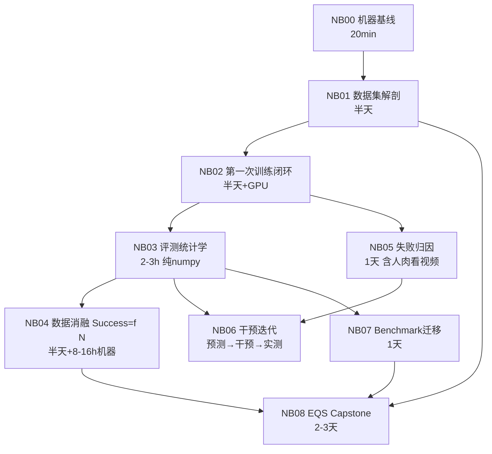

# Notebook 系列：递进闭环训练（NB00–NB08）

九本 notebook，每本都是一次完整闭环：**跑 → 看输出 → 分析 → 复盘落盘**。
后一本以前一本落盘的结果为输入（通过 `results/*.json` 传递），账连着账，跳级会直接报错。

## 递进地图

能力递进的逻辑：

| 阶段 | notebook | 练的是什么 |
|---|---|---|
| 会看 | NB00–01 | 机器和数据的每个数字都能解释 |
| 会训 | NB02 | 亲手把 policy 从数据训到能跑 |
| 会信 | NB03 | 什么样的评测数字才可信（**分水岭**：从此你报数字带置信区间） |
| 会定价 | NB04 | 数据的边际价值第一次被你测出来 |
| 会归因 | NB05–06 | 失败分类 → 预测 → 干预 → 解释差值（科学家闭环） |
| 会横比 | NB07 | 跨 benchmark 的含金量换算 |
| 会立标准 | NB08 | 自己的质量分 + 亲手校准（signature 产出） |

对应课表：NB01→Week2 ｜ NB02→Week3 ｜ NB03→(课表没有，专为评测定位补的) ｜
NB04→Week3/6 ｜ NB05→Week5 ｜ NB06→Week5/6 ｜ NB07→Week8 ｜ NB08→Week6/9–12。

## 运行纪律（六条）

1. **一坐一环**：一次坐下只推进一本；跑到一半不复盘就离开 = 这一环作废重跑。
2. **检查点必核**：cell 里的 ✅ 检查点是自问题，答不出就停在原地查，不许"先跑过去再说"。
3. **复盘必填**：每本最后的复盘模板填完并 commit，才算完成。允许粗糙，禁止事后美化。
4. **账本只增不改**：`results/*.json` 是 append-only 历史；跑错了就再跑一条记录，不删旧的——失败记录是留痕的一部分。
5. **协议一致**：NB03 定下的评测协议，之后所有 notebook 沿用；中途想改，先在复盘里写明理由再改，并注明从哪次运行起生效。
6. **图和 CSV 都 commit**：`results/` 下的 png/csv/json 全部进 git（视频除外，太大，进 `.gitignore`）。

## 时间与算力预算

| notebook | 人工 | 机器 | 需要 GPU |
|---|---|---|---|
| NB00, NB01, NB03 | 各 0.5 天 | 忽略 | 否 |
| NB02 | 0.5 天 | 2–6h | 是 |
| NB04 | 0.5 天 | 8–16h（8 个 run，云上可并行） | 是 |
| NB05, NB06 | 各 1 天 | 一次训练 | NB06 是 |
| NB07 | 1 天 | 忽略 | 否 |
| NB08 | 1 天 | 3 个 run | 是 |

无本地 GPU 的跑法：notebook 全部本地跑（数据、分析、统计都不需要 GPU），
训练命令复制到云机器（AutoDL 4090 ≈ ¥2/h）执行，checkpoint 和 eval 结果拉回本地填账本。
全系列云上训练总成本约 ¥100–200。

## 已知的坑（设计即如此）

- NB02/04 的训练与评测命令**故意**要求你先看 `--help` 再组装——LeRobot API 随版本变化，
  「照 help 修命令」本身就是练习的一部分，修不动时去翻 LeRobot 源码，这是通往上游贡献的门。
- NB05 的人肉看视频不许外包给脚本。失败视频看得不够多的人，做不了失败归因专家。
- NB06 的预测必须先落盘再动手，账本会留时间戳——对自己作弊没有意义。
